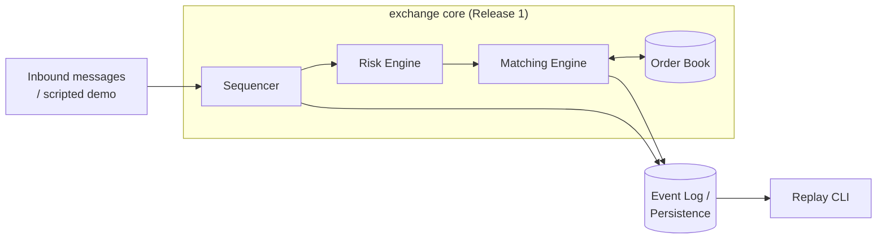

# MicroSim-Quant

[](https://github.com/aravgarg28/MicroSim-Quant/actions/workflows/pr.yml)
[](LICENSE)

> A deterministic, high-performance simulated electronic exchange and market-microstructure
> research platform: a C++20 price-time-priority matching engine with a configurable latency
> laboratory, agent-based order flow, and a Python research interface for running reproducible
> market-making experiments.

**Status: Release 1 — correct single-instrument exchange simulator.** This is the engine core:
a differential-tested, deterministic matching engine with a scripted demo and a byte-identical
replay CLI. Market data, accounting, agents, strategies, and the Python interface land in
Release 2+; see [Roadmap](#roadmap--docs-index) below.

## What this is / what it is not

**This is:**
- A price-time-priority matching engine (limit + market orders, cancel, modify) built from a
  spec, with every rule numbered in [`docs/domain/EXCHANGE_RULES.md`](docs/domain/EXCHANGE_RULES.md).
- Correctness-first: a deliberately slow, obviously-correct reference book that an optimized
  book is checked against on every message, in CI, on generated adversarial scenarios.
- Deterministic by construction: identical input ⇒ byte-identical output, proven by an
  on-disk replay CLI, not just an in-process test.
- A staged project — each release is scoped, specified, and reviewed before code, with every
  decision logged in [`docs/DECISIONS.md`](docs/DECISIONS.md).

**This is not:**
- Connected to any real market, exchange, or live data feed — everything here is simulated.
- A trading system, and it makes no profitability claims of any kind.
- Multi-instrument, multi-venue, or distributed — Release 1 is one instrument, one process,
  single-threaded (see [Limitations](#limitations)).
- Feature-complete — accounting, risk beyond basic checks, agents, and the Python bindings are
  Release 2+.

## Architecture

MicroSim is a single-process, single-threaded discrete-event simulation: no network, no IPC.
Everything a participant sends enters through the sequencer; everything the engine does is a
pure function of that sequenced input.



The full target architecture (market data, latency model, agents, accounting — Release 2+) is
in [`docs/architecture/SYSTEM_ARCHITECTURE.md`](docs/architecture/SYSTEM_ARCHITECTURE.md).

## Feature summary

| Area | Release 1 status | Spec |
|---|---|---|
| Order types & lifecycle | Limit, market, cancel, modify (cancel/replace with priority rules) | [`EXCHANGE_RULES.md`](docs/domain/EXCHANGE_RULES.md) |
| Matching | Price-time priority, partial fills, deterministic tie-breaking | [`EXCHANGE_RULES.md`](docs/domain/EXCHANGE_RULES.md) §5 |
| Order book | Reference (`std::map`, oracle) + optimized `FastBook` (tick-indexed) | [`ORDER_BOOK_DESIGN.md`](docs/engine/ORDER_BOOK_DESIGN.md) |
| Fees | Flat maker rebate / taker fee per lot, exact-integer arithmetic | [`EXCHANGE_RULES.md`](docs/domain/EXCHANGE_RULES.md) §11 |
| Risk | Pre-trade open-order count, party size cap, worst-case position | [`EXCHANGE_RULES.md`](docs/domain/EXCHANGE_RULES.md) §9 |
| Sequencing & replay | Gap-free sequencing, on-disk event log, byte-identical replay | [`DATA_FLOW.md`](docs/architecture/DATA_FLOW.md) |
| Correctness | 17 documented invariants, property tests, differential tests | [`ENGINE_INVARIANTS.md`](docs/domain/ENGINE_INVARIANTS.md) |
| Benchmarking | Google Benchmark harness + regression comparator, baseline v1 | [`BENCHMARK_PLAN.md`](docs/performance/BENCHMARK_PLAN.md) |
| Market data, accounting, agents, Python | Release 2+ | [`ROADMAP.md`](docs/product/ROADMAP.md) |

## Market rules in 30 seconds

- **Price-time priority.** At each price level, orders fill in strict arrival order (FIFO); a
  marketable order walks price levels best-to-worst until filled or the book is exhausted.
- **Modify keeps priority only if it shrinks quantity at the same price.** Any price change, or
  any quantity *increase*, is treated as cancel + new arrival and loses queue position.

  | Modify | Priority |
  |---|---|
  | Price change (any) | Lost — re-queued at the back, may match immediately if now marketable |
  | Quantity decrease, same price | Kept — remaining quantity reduced in place |
  | Quantity increase, same price | Lost — re-queued at the back |

- **Fees are flat per lot, exact integers.** Taker pays `qty × taker_fee_per_lot`; maker
  receives `qty × maker_rebate_per_lot`. No rounding exists anywhere in the fee path.

Full rule set (order lifecycle, cancellation, self-trade, session end, reject codes): see
[`docs/domain/EXCHANGE_RULES.md`](docs/domain/EXCHANGE_RULES.md).

## Quick start

Requirements: CMake ≥ 3.27, Ninja, a C++20 compiler (AppleClang 16+ / Clang 16+ / GCC 13+).

```bash
git clone https://github.com/aravgarg28/MicroSim-Quant.git
cd MicroSim-Quant

# Configure, build, and run the full test suite (189 tests: unit, property, differential)
cmake --preset debug
cmake --build --preset debug
ctest --preset debug

# Run the scripted demo: 7 orders, 4 trades, prints the resulting book
./build/debug/bin/microsim_run

# Same demo, but tee an event log and replay it — proves determinism on disk (INV-10)
./build/debug/bin/microsim_run /tmp/microsim_demo
./build/debug/bin/microsim_replay /tmp/microsim_demo/input.log /tmp/microsim_demo/events.log
```

`microsim_replay` regenerates the event stream from the recorded input and byte-compares it to
the recorded output; it prints `replay verified: event log reproduced byte-identically` and
exits `0` on success, non-zero on any mismatch.

Sanitizer and optimized presets, formatting, and the full contributing workflow are documented
below under [Development](#development).

## Correctness story

Every matching rule is checked three ways:

1. **Unit tests per rule** — one test class per exchange-rule section (cancel, modify, risk,
   session end, ...).
2. **Property-based tests over generated scenarios** — a seeded generator produces order flow
   across 7 profiles (uniform, cancel-heavy, crossing-heavy, adversarial, boundary, empty-book,
   gap-book) and checks all 17 invariants in [`ENGINE_INVARIANTS.md`](docs/domain/ENGINE_INVARIANTS.md)
   after every message, with automatic failure shrinking. CI runs this at a fixed per-PR budget
   (all profiles × 4 seeds × 2,000 messages); a larger nightly sweep (100 seeds × 10⁶ messages)
   is designed and documented but not yet wired — see the [Release 1 audit](docs/execution/R1_25_AUDIT.md).
3. **Differential testing** — the optimized `FastBook` is run in lockstep against the slow,
   obviously-correct reference book on identical input; full book state and event stream must
   match after every message (INV-15). A deliberately-mutated book is included in the test
   suite to prove the harness actually catches divergence.

Sanitizer builds (AddressSanitizer + UndefinedBehaviorSanitizer) are hard CI failures, not
warnings. Determinism is checked at three strengths, including two-process byte-identical
replay from disk (see [Quick start](#quick-start)).

## Limitations

- **Single instrument, single venue, single process.** No cross-instrument or cross-venue
  interaction exists yet.
- **No real market data or realism claims.** Order flow in Release 1 is a hand-scripted demo;
  seeded stochastic flow (Poisson + noise agents) arrives in Release 2.
- **No accounting or P&L yet.** Fee fields are on every fill event so the schema won't change
  later, but nothing aggregates them into positions or P&L until Release 2.
- **No latency model.** All messages are processed at zero simulated latency; the latency
  laboratory is a later release.
- **Nightly-scale property/fuzz coverage is designed but not yet running.** CI proves
  correctness at a smaller per-PR budget; see the audit linked above for exactly what is and
  isn't covered today.
- **Benchmarks are a v1 baseline, not yet optimized or independently re-measured.** See
  [`docs/performance/`](docs/performance/) for methodology and current numbers.

## Roadmap + docs index

MicroSim ships in scoped releases (full plan: [`docs/product/ROADMAP.md`](docs/product/ROADMAP.md)):

- **Release 1 (this README): correct single-instrument exchange** — done, this repository.
- **Release 2: market data, accounting, Python research interface.**
- **Release 3+: strategies, latency model, research findings, replication, demo polish.**

Guided reading, by time budget:

- **5 minutes:** this README, then [`docs/domain/EXCHANGE_RULES.md`](docs/domain/EXCHANGE_RULES.md) §5 (matching).
- **30 minutes:** [`docs/product/PROJECT_VISION.md`](docs/product/PROJECT_VISION.md),
  [`docs/architecture/SYSTEM_ARCHITECTURE.md`](docs/architecture/SYSTEM_ARCHITECTURE.md),
  [`docs/domain/ENGINE_INVARIANTS.md`](docs/domain/ENGINE_INVARIANTS.md).
- **120 minutes:** the full [`docs/`](docs/) tree, starting from
  [`docs/execution/IMPLEMENTATION_TASKS.md`](docs/execution/IMPLEMENTATION_TASKS.md) and
  [`docs/DECISIONS.md`](docs/DECISIONS.md) for the "why" behind every design choice.

## Development

```bash
# Configure, build, and test (development default)
cmake --preset debug
cmake --build --preset debug
ctest --preset debug

# Sanitizers (AddressSanitizer + UndefinedBehaviorSanitizer, findings are hard failures)
cmake --preset asan-ubsan && cmake --build --preset asan-ubsan && ctest --preset asan-ubsan

# Optimized build (benchmarks and experiments)
cmake --preset release && cmake --build --preset release && ctest --preset release
```

Format all C++ sources (or `--check` to verify, as CI does):

```bash
./scripts/format.sh          # rewrite in place
./scripts/format.sh --check  # verify only
```

**Canonical `clang-format` version: 20.1.7.** CI pins it via `pip install clang-format==20.1.7`
so formatting is reproducible across machines; use the same version locally to avoid spurious
diffs (`pipx install clang-format==20.1.7`, or Homebrew's is close enough for the current code).

### Contributing workflow

- Work happens on `task/<TASK-ID>-<slug>` branches, one implementation task per pull request
  (see [`docs/execution/IMPLEMENTATION_GUIDE.md`](docs/execution/IMPLEMENTATION_GUIDE.md) and
  [`docs/execution/IMPLEMENTATION_TASKS.md`](docs/execution/IMPLEMENTATION_TASKS.md)).
- CI ([`.github/workflows/pr.yml`](.github/workflows/pr.yml)) must be green before merge:
  formatting, plus build + test on Linux (`debug`, `asan-ubsan`, `release`) and macOS
  (`debug`). Warnings are errors on CI (`-Werror`); locally they are warnings so iteration
  stays unblocked.
- **Recommended branch protection for `main`** (set once by the repo owner in GitHub
  Settings → Branches): require the `CI` status checks to pass, require a pull request before
  merging, and disallow force-pushes. This keeps `main` always-green, which the roadmap
  depends on.

## License

MIT — see [`LICENSE`](LICENSE). Every design decision behind this project is recorded, with
alternatives and rationale, in [`docs/DECISIONS.md`](docs/DECISIONS.md).
