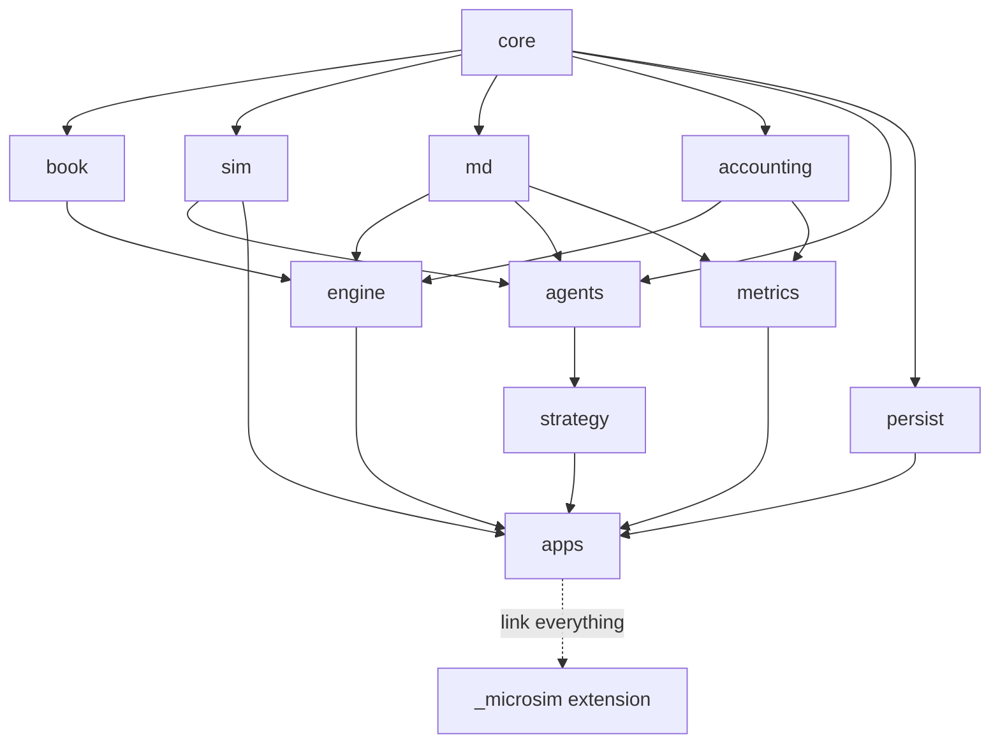

# Component Boundaries

How the modules in `SYSTEM_ARCHITECTURE.md` map to build artifacts, and the dependency rules
that keep the graph acyclic.

## Build-artifact mapping

| Module | Artifact | Kind | Why |
|---|---|---|---|
| `core` | `microsim_core` | static lib (header-heavy) | Strong types are templates/constexpr-heavy; the few .cpp files (enum names, config validation) keep it a real target for tooling |
| `book` | `microsim_book` | static lib | Two implementations + shared concept; benchmarked in isolation |
| `engine` | `microsim_engine` | static lib | The exchange pipeline |
| `md` | `microsim_md` | static lib | Publisher + consumer (consumer deliberately message-only) |
| `sim` | `microsim_sim` | static lib | Clock, latency, RNG, replay |
| `agents` | `microsim_agents` | static lib | Flow generator + noise agents + Participant interface |
| `strategy` | `microsim_strategy` | static lib | Market makers |
| `accounting` | `microsim_accounting` | static lib | Positions/P&L |
| `metrics` | `microsim_metrics` | static lib | Research metrics |
| `persist` | `microsim_persist` | static lib | Logs + export |
| `pybind` | `_microsim` | Python extension (shared) | The only shared library in the project |
| `apps` | `microsim_run`, `microsim_replay` | executables | CLI entry points |
| tests/benchmarks/fuzzers | one target per suite | executables | Never linked into shipping artifacts |
| `experiments` | Python package `microsim` (wraps `_microsim`) | pure Python | Research layer |

**Why static libraries, not header-only:** header-only maximizes inlining but destroys
incremental build times, hides layering violations (any header can reach any other), and makes
symbol-level tooling (coverage, sanitizer suppressions) coarser. Static libs give the linker
visibility, keep hot-path inlining available via LTO in Release builds, and make each layer a
compilable, testable unit. Individual *types* stay header-only inside `core` where appropriate.

## Dependency graph (arrows = "may depend on")

Textual rules (CI-enforced by target link interfaces — a violating `#include` fails to build):

1. `core` depends on nothing.
2. `book`, `sim`, `accounting`, `md`, `persist` depend only on `core`.
3. `engine` depends on `core`, `book`, `accounting` (read-only risk interface), `md`
   (publisher half).
4. `agents` depends on `core`, `md` (consumer half), `sim`. **Never** `book`/`engine`.
5. `strategy` depends on `agents` (Participant interface), `core`, `md`, `sim`. **Never**
   `book`/`engine`.
6. `metrics` depends on `core`, `md`, `accounting`. Read-only everywhere.
7. `pybind` and `apps` are composition roots: they may depend on everything; nothing depends
   on them.
8. No module includes another's internal headers (`src/`); only its public `include/` tree.

The two **load-bearing prohibitions** — worth stating twice:

- **`strategy`/`agents` ⇸ `engine`/`book`:** participants physically cannot read exchange
  internals; INV-16 (no look-ahead) becomes a linker guarantee.
- **`md` consumer half ⇸ engine types:** the consumer rebuilds books from *messages only*, so
  the public feed is provably sufficient — if it weren't, the consumer differential test
  (consumer book == engine book) would fail.

## Circular-dependency prevention

- The one tempting cycle is `engine ↔ accounting` (engine emits fills → accounting; risk reads
  positions ← accounting). Broken by direction choice: `accounting` is a *lower* layer that
  knows nothing of the engine; the engine both feeds it fill records and queries its read
  interface. Fills are `core` types, so accounting never includes engine headers.
- The second tempting cycle is `md ↔ engine` (engine publishes; consumer feeds agents).
  Broken by splitting `md`: the publisher half is called *by* the engine (engine → md), the
  consumer half never touches engine types at all.
- CMake `target_link_libraries` with `PRIVATE`/`PUBLIC` discipline is the enforcement
  mechanism; the CI graph check (`scripts/check_deps.py`, planned) parses `#include`s as a
  second net.

## Optional frontend (Release 6)

`dashboard/` (FastAPI + React) is a separate top-level tree that consumes **files only**
(event logs, Parquet results). It has zero build coupling to the C++ tree — it cannot delay or
break the engine, by construction.
