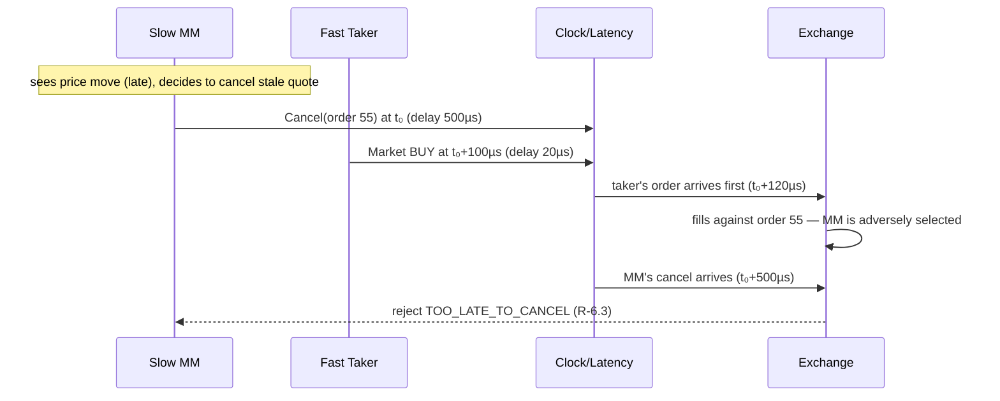

# Data Flow

The canonical path of one strategy decision through the system, and the sequence diagrams for
the flows that matter. All of this happens inside one deterministic event loop; "→ clock"
always means "scheduled as a future event and delivered in logical-time order."

## The eleven steps

1. **Event creation.** A participant (flow generator, agent, or strategy) decides to act at
   logical time `t₀` and emits an order intent (new/cancel/modify).
2. **Latency applied (order-entry).** The latency model computes this participant's
   order-entry delay `d₁`; the intent is scheduled for delivery at `t₀ + d₁`.
3. **Gateway entry.** At `t₁ = t₀ + d₁` the loop delivers the message to the order gateway:
   validation (R-3.3 1–8), duplicate detection, order-ID assignment.
4. **Sequencing.** The sequencer stamps `seq` and `ts_event = t₁`; the sequenced message is
   teed to the input event log (this log alone reproduces the run).
5. **Risk.** Pre-trade checks (§9) run against accounting's read interface; failure emits a
   deterministic reject to the owner (private stream, back through latency).
6. **Matching.** The matching engine executes §5–§7 against the book, to completion.
7. **Emission.** The engine emits, in fixed order: private execution reports (ack/reject,
   fills for both counterparties, cancels), then public market-data deltas and trades stamped
   with `md_seq`.
8. **Consumer update (market-data latency).** Each participant's feed subscription has its own
   market-data delay `d₂(p)`; at `t₁ + d₂(p)` the consumer book builder applies the deltas and
   the participant's view advances.
9. **Strategy reaction.** Participants receive `on_market_data` / `on_execution_report`
   callbacks at their delivery times and may emit new intents (→ step 1).
10. **Accounting & metrics.** Fills update positions/cash/P&L at `t₁` (exchange truth is
    immediate; participant *knowledge* of it is delayed — the gap between the two is exactly
    what latency experiments measure). Metrics observers record everything.
11. **Persistence.** Sequenced inputs (step 4), outbound events, and metric records stream to
    the run's log files; at session end the manifest (seed, config hash, git hash) is written.

## Sequence diagram — aggressive order lifecycle

```mermaid
sequenceDiagram
    participant S as Strategy (P7)
    participant CLK as Clock/Latency
    participant GW as Gateway+Sequencer
    participant RK as Risk
    participant ME as Matcher+Book
    participant MD as MD Publisher
    participant AC as Accounting
    participant C9 as Counterparty (P9)

    S->>CLK: NewOrder BUY 25 @ 10.03 (t₀)
    Note over CLK: +order-entry latency d₁(P7)
    CLK->>GW: deliver (t₁)
    GW->>GW: validate, assign order_id, seq
    GW->>RK: risk checks (§9)
    RK->>ME: accepted
    ME->>ME: match: 10 vs C, 15 vs D (R-5.3/5.4)
    ME->>AC: fills (maker & taker, fees)
    ME->>MD: deltas: level 10.03 removed; trades ×2 (md_seq n, n+1)
    ME-->>CLK: private reports
    Note over CLK: +md latency d₂(p) per subscriber<br/>+order-entry-ack latency per owner
    CLK-->>S: OrderAccepted + 2 Fills (t₁+…)
    CLK-->>C9: Fill (maker) (t₁+…)
    MD-->>CLK: public deltas
    CLK-->>S: book update (t₁+d₂(P7))
    CLK-->>C9: book update (t₁+d₂(P9))
```

Note the two different arrival times of the same public delta at P7 vs P9 — a fast participant
acts on the new book state while a slow one still quotes against the old state. That asymmetry
is the entire mechanism of RQ1.

## Sequence diagram — cancel/replace race (Release 4 flagship scenario)



The distinct `TOO_LATE_TO_CANCEL` reason code exists so this race is *measurable*: its rate is
one of RQ1's dependent variables.

## Replay flow

Replay bypasses steps 1–2 entirely: the recorded **sequenced input log** (step 4's tee) is fed
straight into the gateway with original timestamps. Everything downstream (5–11) re-executes.
Byte-identical output (INV-10) then proves the engine is a pure function of its sequenced
input. Agents/strategies are *not* run during replay — replay reproduces exchange behavior,
not decision-making (re-running decisions requires a full re-simulation with the same seed,
which must also be byte-identical; both forms are tested).

## Information-visibility summary

| Data | Exchange | Owner | Other participants | Metrics |
|---|---|---|---|---|
| Order acks/rejects/fills (private) | ✓ | ✓ (delayed) | ✗ | ✓ |
| Book deltas, trades w/ aggressor side (public) | ✓ | ✓ (delayed) | ✓ (delayed, per-participant) | ✓ |
| Resting-order ownership | ✓ | own only | ✗ | ✓ |
| Queue position of own order | ✓ | inferable from feed | inferable | ✓ (exact, R4 tracker) |
| Positions/P&L | via accounting | own only | ✗ | ✓ |

Metrics see everything (they are the experimenter); participants see only rows 1–2. A
participant computing queue position must *infer* it from the public feed exactly as real
traders do — the exact tracker in row 4 is measurement apparatus, never strategy input.
