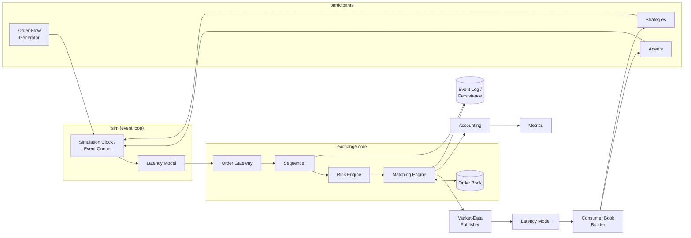

# System Architecture

MicroSim is a **single-process discrete-event simulation** built from statically-linked C++
libraries, driven by one deterministic event loop, with Python bindings at the outermost
boundary. There is no network, no IPC, and no thread pool in the core path (threading is a
Release-5 evaluation — see `THREADING_MODEL.md`).

The architectural spine:

Everything a participant does enters the exchange through the clock (with latency applied);
everything a participant sees leaves the exchange through the market-data feed (with latency
applied). Strategies can never touch `OB` directly — that is what makes no-look-ahead (INV-16)
a structural guarantee rather than a discipline.

---

## Module catalog

Each module lists: Responsibility · Inputs · Outputs · Owned state · Interface (conceptual) ·
Dependencies · Threading · Failure behavior · Test strategy. Library/target mapping is in
`COMPONENT_BOUNDARIES.md`.

### 1. `core` — vocabulary types and events
- **Responsibility:** Defines `Price`, `Qty`, `Cash` (strong int64 wrappers), IDs, `Side`,
  enums (order type, reject/cancel reasons per R-14), all message/event structs, instrument
  and participant config structs, and compile-time unit-safety (you cannot add a Price to a
  Qty).
- **Inputs/Outputs:** none — pure types.
- **Owned state:** none.
- **Dependencies:** none (foundation; everything depends on `core`).
- **Threading:** trivially safe (immutable value types).
- **Failure behavior:** invalid construction is unrepresentable or throws at the boundary;
  inside the engine, types are already-validated values.
- **Tests:** unit tests for conversions/rounding at boundaries; static_asserts for type safety.

### 2. `book` — order-book implementations
- **Responsibility:** Maintain resting orders per instrument: price levels, FIFO queues,
  best-bid/ask, order lookup by `order_id`. Two implementations behind one concept:
  `ReferenceBook` (obviously correct, `std::map`-based) and `FastBook` (optimized — design in
  `docs/engine/ORDER_BOOK_DESIGN.md`).
- **Inputs:** add/reduce/remove/re-queue operations from the matching engine only.
- **Outputs:** queries (best price, level depth, front-of-queue order, full state dump for
  differential tests).
- **Owned state:** all resting-order storage (see `MEMORY_MODEL.md` for ownership details).
- **Dependencies:** `core`.
- **Threading:** single-owner (the engine thread); no internal synchronization.
- **Failure behavior:** structural violations are programming errors → assert/terminate in all
  builds (an exchange with a corrupt book must not continue).
- **Tests:** unit; property (INV-1..4, 13); **differential Reference vs Fast (INV-15)**; fuzz
  via engine; benchmarks (insert/cancel/match paths).

### 3. `engine` — gateway, sequencer, risk, matcher
- **Responsibility:** The exchange. Four subcomponents composed in a fixed pipeline:
  - **Order Gateway:** owns inbound message validation (R-3.3 items 1–8), client-order-ID
    dedup, order-ID assignment (R-4.1), order registry (state machine per R-4.2).
  - **Sequencer:** assigns `seq`/`seq_out`/`ts_event` (R-10); the engine's behavior is a pure
    function of the sequenced stream; tees the sequenced stream to persistence.
  - **Risk Engine:** deterministic pre-trade checks (§9) against accounting state.
  - **Matching Engine:** the §5–§7 algorithm against `book`; emits fills, book deltas, order
    events; executes session-end cancellation (R-12.3).
- **Inputs:** timestamped inbound messages (from the event loop, post-latency).
- **Outputs:** ordered event stream: acks/rejects/fills/cancels/modifies + market-data deltas
  + private participant reports (R-13.2 split: public vs private).
- **Owned state:** order registry, seq counters, session state; *not* positions (accounting
  owns those; risk queries accounting via read interface).
- **Dependencies:** `core`, `book`, `accounting` (read-only interface for risk).
- **Threading:** single-threaded; processes one message to completion (R-5.1).
- **Failure behavior:** invalid *messages* → deterministic rejects (never exceptions); internal
  inconsistencies → assert/terminate.
- **Tests:** per-rule unit tests (each R-x.y cited in a test name); property tests (all INVs);
  fuzz target on the gateway; matching benchmarks.

### 4. `md` — market-data publisher and consumer
- **Responsibility:** **Publisher:** translate engine book deltas/trades into the public feed
  (per-instrument gap-free `md_seq`, snapshots on demand, no participant identities — R-13).
  **Consumer:** rebuild a book view from the feed (snapshot + incrementals, gap detection);
  this is the only market view participants get.
- **Inputs:** engine event stream (publisher); feed messages post-latency (consumer).
- **Outputs:** feed messages (publisher); book views + feature queries (consumer).
- **Owned state:** publisher: md_seq counters, last snapshot; consumer: reconstructed books,
  per-consumer cursor.
- **Dependencies:** `core` (consumer additionally: nothing from engine — it sees only messages;
  this enforces the information boundary).
- **Threading:** single-threaded with the loop.
- **Failure behavior:** consumer detecting a gap (impossible in-process, testable via fault
  injection) requests a snapshot — the recovery path exists and is tested even though the
  in-process transport never drops.
- **Tests:** differential: consumer book == engine book at every md_seq (INV-16b); snapshot
  recovery tests; serialization round-trip; publish-path benchmarks.

### 5. `sim` — clock, event queue, latency, RNG, replay
- **Responsibility:** The deterministic heart. **Clock/event queue:** logical-time priority
  queue with total ordering (time, priority class, insertion seq — spec:
  `docs/simulation/SIMULATION_CLOCK.md`). **Latency model:** maps (participant, message class)
  → delay, deterministic per seed (spec: `docs/simulation/LATENCY_MODEL.md`). **RNG:** named
  per-purpose streams (e.g. `flow`, `latency.P3`) derived from a master seed, so adding a
  consumer never perturbs others' draws. **Replay:** re-run from a recorded sequenced input
  log, bypassing generation (INV-10 strength 3).
- **Inputs:** scheduled callbacks/messages from all producers; master seed.
- **Outputs:** ordered delivery of every event in the simulation.
- **Owned state:** event queue, logical now, RNG streams, replay cursor.
- **Dependencies:** `core`.
- **Threading:** single-threaded loop owner.
- **Failure behavior:** scheduling into the past is a programming error → assert.
- **Tests:** ordering/tie-break unit tests; determinism tests (INV-10); RNG stream independence
  tests; event-queue benchmarks.

### 6. `agents` — order-flow generator and participant agents
- **Responsibility:** Non-strategic market participants: Poisson order-flow generator, noise
  liquidity provider, noise taker (Release 5 adds informed/momentum/mean-reversion). Also owns
  the **Participant interface** shared with strategies: `on_market_data(view, time)`,
  `on_execution_report(report, time)`, emitting order intents to the clock.
- **Inputs:** market-data views (post-latency), execution reports, RNG stream, params.
- **Outputs:** order intents (new/cancel/modify).
- **Owned state:** per-agent params and internal state (e.g. outstanding order list).
- **Dependencies:** `core`, `md` (consumer views), `sim` (scheduling, RNG).
- **Threading:** single-threaded with the loop.
- **Failure behavior:** agents may only fail by emitting invalid intents, which the exchange
  rejects like any other message — agent bugs cannot corrupt the exchange.
- **Tests:** statistical validation (empirical rates vs configured); scripted-scenario
  behavioral tests; determinism.

### 7. `strategy` — strategy engine and market makers
- **Responsibility:** Strategies as participants (same interface as agents) plus the
  market-making-specific loop: quote computation, order management (place/modify/cancel to
  reach target quotes), per-strategy risk limits, kill switch (flatten + stop on loss/drawdown
  limits — spec: `docs/risk/RISK_ENGINE.md` §strategy-side).
- **Inputs/Outputs/Ownership:** as `agents`, plus strategy parameters and internal estimators
  (e.g. rolling volatility).
- **Dependencies:** `core`, `md`, `sim`; **never** `engine` or `book` (information boundary).
- **Tests:** decision-table unit tests (crafted book state → expected quotes); no-look-ahead
  test (INV-16); A/B experiment reproducibility.

### 8. `accounting` — positions, cash, P&L
- **Responsibility:** Per-participant position, cash, fees, average entry price,
  realized/unrealized P&L, drawdown; venue fee take; reconciliation checks (INV-11); mark-price
  policy (R-12.4). Spec: `docs/accounting/POSITION_AND_PNL.md`.
- **Inputs:** fill events (with fee fields), mark-price updates, session-end.
- **Outputs:** account snapshots; read-only interface for risk checks and metrics.
- **Owned state:** all account state.
- **Dependencies:** `core`.
- **Threading:** single-threaded with the loop.
- **Failure behavior:** reconciliation failure → assert (an accounting error invalidates every
  research result; fail fast and loud).
- **Tests:** worked-example unit tests from the accounting doc; property reconciliation over
  generated runs (INV-11); integer-overflow boundary tests.

### 9. `metrics` — research metrics collector
- **Responsibility:** Streaming computation of `docs/research/METRICS.md`: fill rate, spread
  capture, markouts/adverse selection, inventory stats, queue-position tracking (R4),
  order-to-trade ratio, latency-adjusted measures; emits tidy row-oriented records for export.
- **Inputs:** public feed + private reports + account snapshots (a strict superset of what a
  participant sees — metrics are *observers*, they never feed back into decisions).
- **Outputs:** metric records to persistence.
- **Dependencies:** `core`, `md`, `accounting`.
- **Failure behavior:** metric errors must never affect simulation state (observer isolation —
  enforced by const interfaces).
- **Tests:** hand-computed fixtures; cross-checks against pandas recomputation in Python tests.

### 10. `persist` — event log and results export
- **Responsibility:** Write/read the sequenced input log (replay source) and the outbound
  event/metric streams; simple length-prefixed binary format with version header + CSV
  export; run-metadata manifest (seed, config hash, git hash, versions). Parquet conversion
  happens Python-side (decision S7).
- **Dependencies:** `core`.
- **Failure behavior:** I/O errors abort the run with a clear message (no partial silent
  results).
- **Tests:** round-trip (write→read→byte-compare); versioning; corrupt-file rejection (fuzz).

### 11. `pybind` — Python bindings
- **Responsibility:** The `microsim` Python module: build `SimulationConfig` from Python
  dicts/dataclasses, run simulations, return results as NumPy arrays / Arrow tables (copies —
  never views into C++ memory), expose replay and metric retrieval. Coarse-grained: Python
  configures and analyzes; C++ runs. Spec: `docs/python/PYTHON_API.md`.
- **Dependencies:** everything above; nothing depends on it.
- **Failure behavior:** C++ exceptions → Python exceptions with context; engine asserts are
  documented as process-fatal.
- **Tests:** pytest round-trips; determinism through the binding; leak checks.

### 12. `apps` — executables
- `microsim_run`: CLI — run a config file, write results (also what CI smoke-tests).
- `microsim_replay`: replay an event log, verify determinism, print book states.
- Benchmarks (`benchmarks/`), tests (`tests/`), fuzzers (`fuzz/`) as separate targets.

### 13. `experiments` — Python research layer (no C++)
- Experiment controller: config schema, batch/sweep runner (process-parallel, seed-managed),
  Parquet/DuckDB store, analysis notebooks. Spec: `docs/python/EXPERIMENT_INTERFACE.md`.

---

## Cross-cutting rules

1. **Information boundaries are dependency boundaries.** `strategy`/`agents` cannot link
   against `engine`/`book`. The type system enforces what discipline alone cannot.
2. **One writer per state.** Every piece of state has exactly one owning module; others get
   const views or event copies.
3. **Errors:** invalid *input* → deterministic reject events; broken *invariant* → assert and
   terminate (in Release builds too — a corrupt exchange must not produce research data).
4. **No singletons, no globals, no static mutable state.** Everything is constructed from
   config, enabling many independent simulations per process (needed for Python batch runs).
5. **Time never comes from the OS** inside the simulation. `std::chrono::steady_clock` exists
   only in benchmarks.
