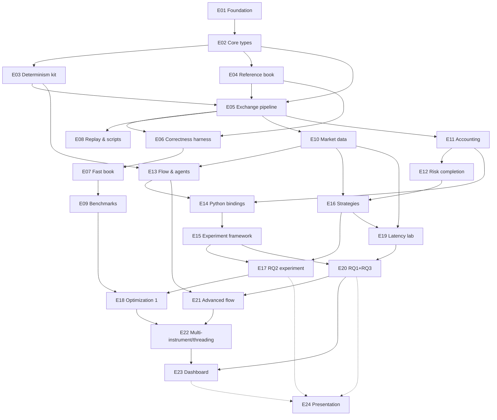

# Dependency Graph

## Epic-level graph

## Parallelizable tracks (single-implementer view: "parallel" = interleavable without rework)

- **After E02:** E03 (RNG/clock), E04 (reference book), and E02's config-parsing tail are
  mutually independent.
- **After E05:** E06 (harness) is the critical path; E08 (replay/scripts) and the persist
  writer can interleave.
- **R2:** E10 (MD) and E11 (accounting) are independent of each other; E13 needs E10; E14
  needs E11+E13.
- **R3:** E16 (strategies) and E15 (experiment framework) proceed in parallel until E17
  joins them. E18 (optimization) must trail E17's pilot (profiles need realistic load) but
  precedes production RQ2 runs only if it lands cleanly — otherwise RQ2 ships on stage-1
  FastBook (results don't care about ns).
- **R4:** E19's latency model and MBO feed are separable subtracks; both precede E20.

## Critical path to first resume-worthy state (R3)

E01 → E02 → E05 → E06 → E07 → E10/E11 → E13/E14 → E16 → E17.
Slack lives in: E08 (replay can trail), E09 (benchmarks can trail until E18), E18 itself
(RQ2 doesn't need it), S3/S4/S5 strategies (S1/S2 suffice for RQ2).

## Rule

A task may start only when its prerequisites' **Definition of Done** is met — not merely
"code exists" (IMPLEMENTATION_TASKS defines DoD per task; OPUS_HANDOFF makes Opus verify
prerequisites before starting).
